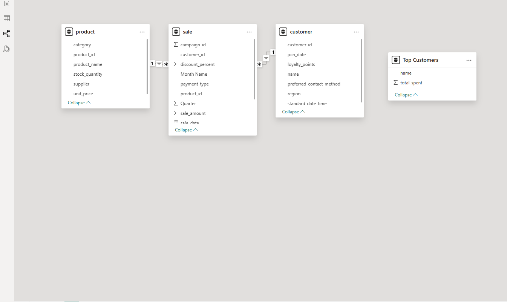
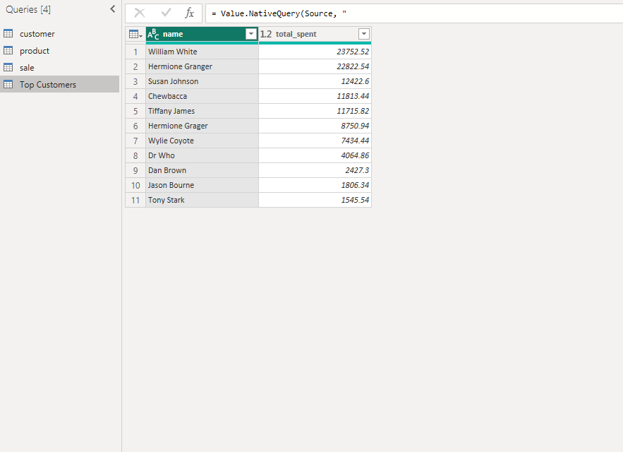
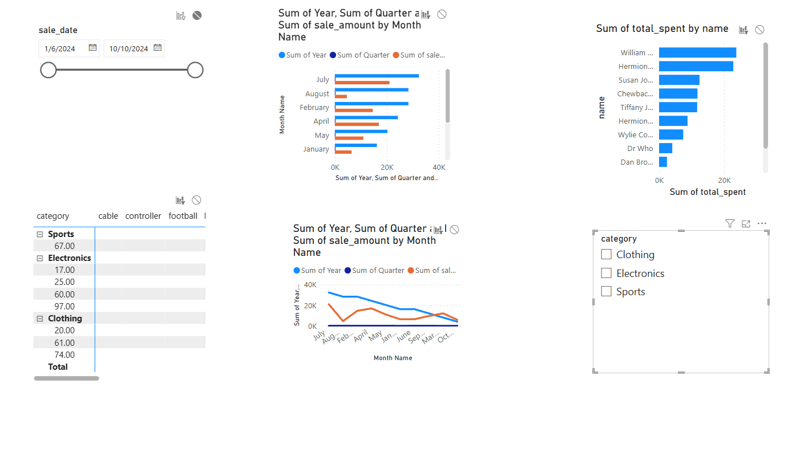

# smart-store-houstonasherlaws
Smart Sales Starter Files
Starter files to initialize the Smart Sales project.

Project Setup Guide (Windows)
Run all commands from a PowerShell terminal in the root project folder.

Step 1 - Create a Local Project Virtual Environment
powershell
Copy
Edit
py -m venv .venv

Step 2 - Activate the Virtual Environment
powershell
Copy
Edit
.venv\Scripts\activate

Step 3 - Install Required Packages
powershell
Copy
Edit
py -m pip install --upgrade -r requirements.txt

Step 4 - (Optional) Verify Virtual Environment Setup
powershell
Copy
Edit
py -m datafun_venv_checker.venv_checker

Step 5 - Run the Initial Project Script
powershell
Copy
Edit
py scripts/data_prep.py
Initial Package List
These are the required dependencies for the project:

pip

loguru

ipykernel

jupyterlab

numpy

pandas

matplotlib

seaborn

plotly

pyspark==4.0.0.dev1

pyspark[sql]

📊 Overview
This Power BI project demonstrates an end-to-end data analysis pipeline, from ETL to visualization. It uses data from a sales database (SQLite) and presents interactive insights in a Power BI dashboard.

🧠 SQL Queries & Reports
Top Customers
sql
Copy
Edit
SELECT c.name, SUM(s.sale_amount) AS total_spent
FROM sale s
JOIN customer c ON s.customer_id = c.customer_id
GROUP BY c.name
ORDER BY total_spent DESC;
This query aggregates total sales per customer and ranks them by spending.

Sales Trends Over Time
Date fields were extracted in Power BI:

Year

Quarter

Month

These were used to build a drillable time series chart.

📐 Dashboard Design Choices
Slicer: Enables filtering by product category.

Bar Chart: Shows top customers by total sales.

Line Chart: Displays sales trends across time (year → quarter → month).

Matrix: Slices data by product and region.

## Power BI Model View

## Query Results

## Final Dashboard

Color choices were kept consistent for clarity. Charts were positioned logically: slicers on the left, visuals on the right.

🔗 Data Model / Schema
Spark SQL Schema or Power BI Model View

Your Power BI data model showing relationships between tables.

✅ Query Results

Output of the Top Customers SQL query.

🖥️ Final Dashboard / Charts

Fully interactive Power BI dashboard with drilldowns and slicers.

✅ Steps Taken:
Connected to the SmartSalesDSN ODBC Data Source

Used the built-in Odbc.DataSource function in Power BI to connect to the existing SmartSalesDSN.

Created a Native SQL Query

Wrote a custom SQL query using Value.NativeQuery to join the sale and product tables.

Aggregated total sales (SUM(s.sale_amount)) by product_name.

Sorted the results in descending order to highlight top-selling products first.

Loaded the Query into Power BI

Loaded the result set into Power BI as a new table.

Used it to generate visualizations such as bar charts or tables showing top-performing products.

## Sales By product name
